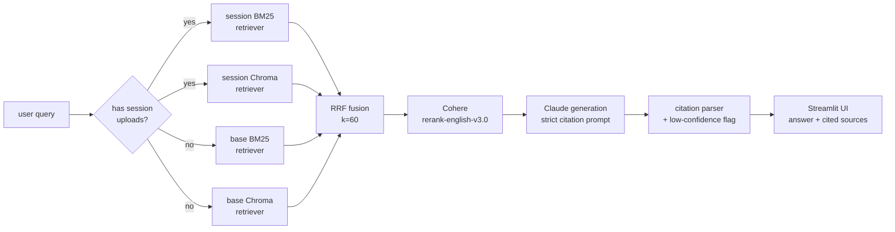

# Legal Contract Lookup — A Retrieval-Augmented Chat for Contracts

A grounded chat system for querying legal contracts (employment agreements, non-competes, royalty agreements, service contracts, construction contracts) with **clause-level citations**, **strict no-hallucination guardrails**, and a **15-question RAGAS benchmark** with **Faithfulness 0.92** on a Claude-as-judge eval.

Users can upload their own contracts in a per-session sandbox — when they do, the system queries _only_ their files; otherwise it queries a small built-in demo corpus. Every answer includes inline `[N]` references that link back to the exact source PDF, page, and (when detectable) clause number.

---

## Highlights

- **Hybrid retrieval**: parallel BM25 (keyword) + dense vector (semantic) over ChromaDB, fused with Reciprocal Rank Fusion (`k=60`), then re-scored with Cohere `rerank-english-v3.0`.
- **Strict citation contract**: the LLM is constrained to cite every claim with `[N]` references; a parser maps those back to source/page/clause for the UI. If the answer isn't in the retrieved chunks, the model returns a fixed refusal sentinel — never fabricated content.
- **Mode-switch retrieval (base XOR session)**: a query never spans both the demo corpus and a user's uploads. Mixing template language with a real contract pollutes relevance, so the system picks exactly one collection based on whether the session has uploaded files.
- **Page-then-chunk ingestion**: each PDF page becomes a Document, then split with `RecursiveCharacterTextSplitter` at 300 tokens / 50 overlap. Clause numbers are detected per chunk via best-effort regex (precision-tuned after a manual audit found 40% false-positive headings in the first attempt).
- **RAGAS evaluation harness**: 15 hand-authored question/reference pairs grounded in the 5 base contracts, scored on Faithfulness / Answer Relevancy / Context Precision / Context Recall / Answer Correctness. Claude is wired in as the judge.

---

## Pipeline architecture



Every stage adds its own score annotation to the document metadata (`bm25_score`, `similarity_score`, `rrf_score`, `rerank_score`) and these are stripped before the LLM call so the model only sees canonical metadata (`source`, `page`, `clause_number`, `contract_type`, `collection`).

---

## Evaluation results

Run on a hand-authored 15-question golden set covering five categories (BM25-friendly, semantic, multi-document, out-of-corpus, edge). Judge LLM is Claude (`claude-sonnet-4-6`); embedding-based metrics use the same BGE-small model used by retrieval. Reproduced with `python eval/run_eval.py`.

| Metric | Overall | Note |
| --- | ---: | --- |
| **Faithfulness** | **0.92** | Strong — pipeline rarely hallucinates. Every failure row scored 1.0 here (errors are *refusals*, not fabrications). |
| Answer relevancy | 0.54 | Pulled down by out-of-corpus rows (RAGAS scores correct refusals 0.0 by design) and by retrieval-recall misses on paraphrased queries. |
| Context precision | 0.56 | Top chunks are mostly on-topic; multi-doc queries dilute the pool. |
| Context recall | 0.68 | The main gap — we retrieve the right *files* but sometimes miss the right *chunks within those files*. |
| Answer correctness | 0.65 | Tracks context recall: when recall slips, correctness follows. |

**Per-category breakdown:**

| Category | Faith | AnsRel | CtxPrec | CtxRecall | Correct |
| --- | ---: | ---: | ---: | ---: | ---: |
| `edge` (broad questions) | 0.98 | 0.85 | 1.00 | 1.00 | 0.73 |
| `bm25_friendly` (exact terms) | 0.83 | 0.68 | 0.75 | 0.75 | 0.64 |
| `multi_doc` (comparison) | 0.87 | 0.92 | 0.22 | 0.74 | 0.57 |
| `semantic` (paraphrased) | 0.97 | 0.23 | 0.38 | 0.50 | 0.51 |
| `out_of_corpus` (should refuse) | 1.00 | 0.00 | — | — | 1.00 |

**What the eval surfaced:** the three lowest-scoring rows are all retrieval-recall failures, not generation failures — the right *file* was found in every case, but the specific clause containing the answer wasn't pulled into the top-k chunks. The LLM then correctly refused rather than fabricating, which is exactly the desired guardrail behavior (`faithfulness=1.0` on every failure row). This is concrete, actionable signal: the next iteration should focus on retrieval depth (higher top_k) and chunk-boundary tuning, not on the LLM.

---

## Quickstart

```bash
# 1. Clone and create a clean Python 3.11 env
git clone https://github.com/anshika1712/Legal_RAG_Application.git
cd Legal_RAG_Application
python3.11 -m venv .venv
source .venv/bin/activate

# 2. Install deps
pip install -r requirements.txt

# 3. Provide your API keys
cp .env.example .env
# Edit .env and fill in:
#   ANTHROPIC_API_KEY=sk-ant-...
#   COHERE_API_KEY=...

# 4. Drop your PDFs into data/raw_contracts/ (or use your own demo set)
#    The repo ships with .gitignore'd slots so the corpus is bring-your-own.
cp /path/to/your/contracts/*.pdf data/raw_contracts/

# 5. Build the persistent index (one-time, ~30s for ~5 PDFs)
python ingestion/indexer.py

# 6. Launch the UI
streamlit run app.py
```

The Streamlit app opens at `http://localhost:8501`. The header shows a clear **BASE MODE** / **SESSION MODE** badge so you always know what scope your next question searches.

---

## Design decisions worth a closer look

These are the choices I'd defend in an interview — each grew out of a problem the naive version hit.

### 1. Mode-switch retrieval instead of merged base+session

The instinct is to RRF-merge base and session results so a user query can hit both. In practice, base contracts are templates and demo files with no semantic relationship to a user's real contract — merging pollutes relevance with template language and produces mixed-source citations (e.g., an answer about the user's employment letter citing the demo royalty agreement). The pipeline now picks exactly one collection per query based on session state, and the UI surfaces the active mode prominently so the user can't be surprised.

### 2. Citation parsing as a contract between LLM and UI

The prompt mandates `[N]` references on every claim. A small parser then extracts those numbers, resolves them to the corresponding reranked chunk, and the UI displays *only* the chunks the LLM actually cited — not the full top-k. For a legal use case, showing chunks the model considered-but-discarded is noise; only the evidence backing the actual claims matters. The parser also enables an "answered" check (`NOT_FOUND_SENTINEL` present or not) which is used to suppress a redundant low-confidence banner when the model has already explicitly refused.

### 3. Auto-index on upload (no "Index" button)

The first version of the UI had a separate "Index uploaded docs" button. Users would drop a file, type a question, and get an answer from the *base* corpus — because they hadn't clicked the button. The widget showed the file as "uploaded" but it wasn't indexed yet. The fix was to auto-index whenever the uploader's file set changes (and auto-clear the session when the user removes all files via the widget's `×`). The Index button is gone; the mode badge guarantees you always know what's being searched.

### 4. Page-then-chunk (not clause-aware) with best-effort clause regex

A clause-aware chunker sounds principled but is wrong for this corpus: contracts use inconsistent numbering (`1.`, `1.1`, `(a)`, `Section X`, `Article Y`), titles run into body text, and PDF extraction loses some heading metadata. The initial regex attempt had a ~40% false-positive rate on clause headings (e.g., body text starting with `"1 rice, 2 chapatis"` from a catering menu got labeled as Clause 1). After a manual audit, the regex was tightened to anchor on the leading text of each chunk, and clause numbers are treated as best-effort metadata — citations work without them.

### 5. Lazy + cached model loading

`_make_embeddings()` is `@functools.lru_cache(maxsize=1)`-decorated so the BGE-small model (~133MB) loads exactly once per process. `pipeline.prewarm()` is wrapped in Streamlit's `@st.cache_resource` so the first request takes ~5s (model load + index load + API client init) and every subsequent one takes ~3-8s end-to-end. Session uploads reuse the already-loaded embeddings via a constructor injection on `VectorRetriever`.

### 6. Graceful fallback on reranker and LLM

If `COHERE_API_KEY` is missing or the reranker call fails, the reranker returns the input order unchanged so the pipeline still produces an answer (lower-quality, but functional). The same pattern protects the LLM call: if Anthropic is unreachable, the user gets a structured fallback with the retrieved chunks dumped raw, instead of a hard 500.

---

## Project structure

```
Legal_RAG_Application/
├── app.py                       # Streamlit chat UI + sidebar uploader + mode badge
├── ingestion/
│   ├── pdf_parser.py            # pdfplumber: PDF → per-page Documents w/ metadata
│   ├── chunker.py               # page-then-recursive split, best-effort clause regex
│   ├── indexer.py               # build/load BM25 + persistent ChromaDB (base corpus)
│   └── session_store.py         # per-session ChromaDB + in-memory BM25 (uploads)
├── retrieval/
│   ├── bm25_retriever.py        # BM25 (rank_bm25), whitespace tokenization
│   ├── vector_retriever.py      # ChromaDB + BGE-small embeddings
│   ├── rrf_fusion.py            # Reciprocal Rank Fusion, k=60
│   ├── reranker.py              # Cohere rerank-english-v3.0 with graceful fallback
│   └── pipeline.py              # orchestrator: mode-switch + caching + the answer() entry point
├── generation/
│   ├── prompt.py                # citation-enforced system prompt + context formatter
│   └── llm.py                   # Claude generator + [N] citation parser + fallback
├── eval/
│   ├── golden_set.json          # 15 hand-authored Q&A pairs across 5 categories
│   ├── run_eval.py              # pipeline → RAGAS → per-question CSV + per-category summary
│   └── results/                 # timestamped CSVs (gitignored; one .gitkeep tracks the dir)
├── tests/
│   └── e2e_smoke.py             # end-to-end pipeline smoke test
├── data/
│   ├── raw_contracts/           # PUT YOUR PDFs HERE (gitignored)
│   └── processed/chroma/        # persisted ChromaDB (gitignored, regenerated on indexer run)
├── requirements.txt
├── .env.example                 # template for ANTHROPIC_API_KEY + COHERE_API_KEY
└── .cursorrules                 # build order + design principles for AI-assisted dev
```

---

## Re-running the evaluation

```bash
python eval/run_eval.py              # full 15-question eval (~3 min, ~$0.30-0.60 in Claude calls)
python eval/run_eval.py --subset 2   # 2-question smoke test (~30s, ~$0.05)
python eval/run_eval.py --out my.csv # custom output path
```

Each run writes a wide CSV under `eval/results/` containing the question, pipeline answer, retrieved chunks, ground truth, and per-question metric scores — useful for A/B comparing scores after a tuning pass. The summary is printed to console with per-category aggregates and the three lowest-scoring rows surfaced for triage.

The eval is locked to **base mode** (the golden set is grounded in the demo corpus) — session uploads are out of scope for the benchmark since their content is user-supplied.

---

## Known limitations / what I'd do next

- **Retrieval-recall gap on paraphrased queries.** Context recall is 0.68; the eval pinpoints three rows where the LLM refused because the right clause wasn't in top-10. First fix to try: bump `top_k` from 10 → 15-20 in `pipeline.py` and re-run the eval. Second fix: experiment with a smaller chunk size (200 tokens) to reduce the chance of a single chunk straddling a clause boundary.
- **Single judge.** Claude judges Claude. Faithfulness numbers are still meaningful (the judge compares answers to retrieved context, which is independent of who generated either), but `answer_correctness` would benefit from a different judge (e.g., GPT-4o) to remove the self-evaluation bias.
- **Golden set size.** 15 questions is enough to surface category-level patterns but too small for tight confidence intervals. The natural next step is collecting real practitioner questions and growing this to ~50.
- **No clause-level citation when clause regex misses.** ~30% of chunks have `clause_number=None` after the tightened regex; citations fall back to `source + page` only. A layout-aware reader (Docling, or commercial LayoutLM-based tools) would close this gap but adds significant install weight.
- **Stale session collections accumulate.** Each browser refresh creates a new `session_<uuid>` Chroma collection; only the active one is queried, but old ones linger on disk. A janitor pass (cron-style or on-startup) is the obvious cleanup.

---

## Stack

- **Python 3.11**
- **LangChain** (`langchain`, `langchain-community`, `langchain-huggingface`, `langchain-chroma`, `langchain-anthropic`, `langchain-text-splitters`)
- **ChromaDB** for vector storage
- **`rank_bm25`** for keyword retrieval (in-process, rebuilt on startup)
- **`sentence-transformers` / BGE-small** for dense embeddings
- **Cohere `rerank-english-v3.0`** for reranking
- **Anthropic Claude** for generation (default: `claude-sonnet-4-6`)
- **RAGAS 0.4** for evaluation
- **Streamlit** for the UI
- **`pdfplumber`** for PDF text extraction
- **`tiktoken`** (`cl100k_base`) for token counting during chunking

See [`requirements.txt`](./requirements.txt) for the full list.

---

## License

MIT — see [LICENSE](./LICENSE) if added.

---

_Built as a portfolio project. Not legal advice; do not rely on outputs for real legal decisions._
